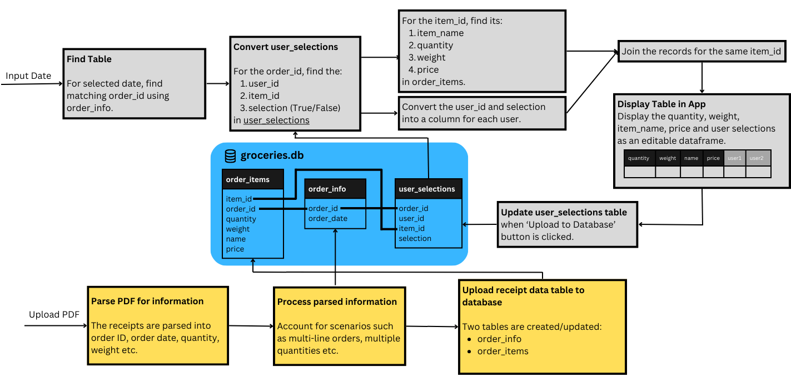

# grocery-manager
This repository stores the scripts pertaining a Streamlit application which reads, processes grocery receipts (just Sainsbury's orders for now).

Currently, the project uses python to extract text from receipt PDFs and process the texts into a readable format by which information can be extracted.


### File Structure
```
grocery_manager
|
|--- data_management
|    |--- OrderDataManager.py   # Class encapsulating all attributes and methods to manage order data
|    |--- UserDataManager.py    # Class encapsulating all attributes and methods to manage user data
|
|--- path_management
|    |--- base.py               # Contain functions to define the absolute path of the project and database
|
|--- receipt_reader             # Directory containing objects/scripts to extract receipt data
|    |--- SainsburysReceipt.py  # Class for a Sainsbury's Receipt for parsing and processing relevant info
|    |--- ...                   # Implement other classes for alternative receipts
|
|--- receipts                   # Folder containing sample receipts for app testing
|    |--- august_21_2023.pdf
|    |--- ...
|
|--- static                     # Folder containing diagrams for documentation
|    |---flowchart.png
|
|--- app.py                     # Script for running the Streamlit App
|--- groceries.db               # SQLite database to store order and user information
|--- requirements.txt           # Text file containing all app dependencies required by Streamlit
|--- setup.py                   # Required to run individual scripts
```

### Programming Structure
The backend of the app is object-oriented and currently utilizes three main classes of objects:

1. SainsburysReceipt
    - Each Sainsbury's receipt can be an object of this class, which is responsible for information extraction from the PDF file.
2. OrderDataManager
    - Contain methods to interact with the two database tables `order_info` and `order_items` which record the information for each individual order and the items respectively.
3. UserDataManager
    - Contain methods to interact with the database table `user_selections` which record the selection of groceries by each user.

### Database Structure
The database contains three tables:
1. `order_info`: Maps an "order_id" to an "order_date"
2. `order_items`: Columns are: item_id, order_id, weight, quantity, name, price
3. `user_selections`: Each row is a combination of a user_id and an item_id, with the corresponding selection True/False.

The diagram below depicts the workflow of the application:


